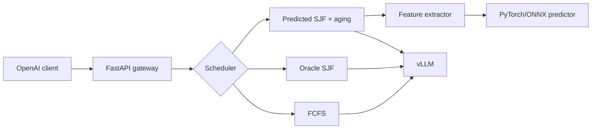
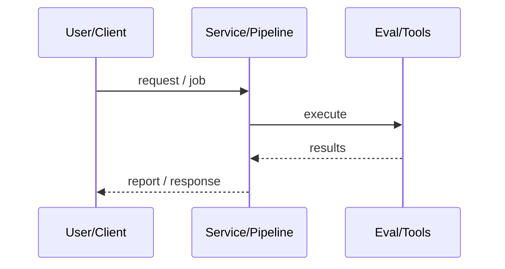
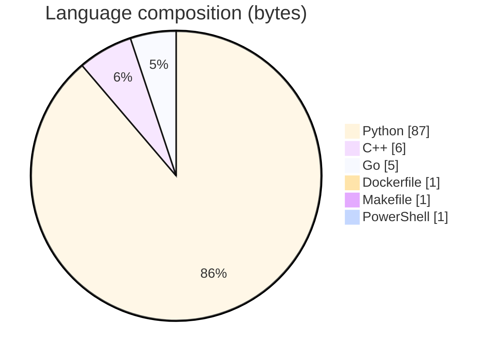

# AI Infrastructure Platform for Distributed Model Serving

### Predicted Shortest-Job-First scheduling gateway for vLLM with ONNX/PyTorch length prediction, plus Go/C++ control-plane pieces.

[](https://github.com/ArchanaChetan07/AI-Infrastructure-Platform-for-Distributed-Model-Serving)
[](https://github.com/ArchanaChetan07/AI-Infrastructure-Platform-for-Distributed-Model-Serving)
[](https://github.com/ArchanaChetan07/AI-Infrastructure-Platform-for-Distributed-Model-Serving)
[](https://github.com/ArchanaChetan07/AI-Infrastructure-Platform-for-Distributed-Model-Serving/actions)

---

## Overview

FCFS inference queues inflate latency for short generations when long jobs occupy the GPU queue without length-aware prioritization.

FastAPI gateway + feature extractor + MLP predictor (PyTorch/ONNX) driving SJF priority queue with aging; FCFS/Oracle baselines; C++/Go companions; Docker/K8s and Prometheus.

v1.0.0 certification: 92 Python tests passed (7 skipped for HF_TOKEN), with 91.58% test coverage on core packages (scheduler, predictor); Go/C++ tests pass, and scheduler comparison artifacts across concurrency 1–32 are checked in.

This repository is maintained as **production-minded portfolio work**: clear architecture, automated checks where present, and metrics that are **traceable to committed artifacts** (never invented).

---

## Architecture

OpenAI client to FastAPI gateway to FCFS/Oracle/Predicted SJF queue to feature+ML predictor to vLLM backend; Prometheus scrapes gateway/scheduler.





---

## Results & repository facts

> Only values found in code, configs, tests, or generated reports are listed. Absence of a clinical/ML accuracy number means it was **not** published in-repo.

| Metric | Value | Source |
|---|---|---|
| Current core Python test run | **70/70 passed (100%)** | `pytest tests --ignore=tests/test_smollm3.py -m "unit or integration"` |
| Python tests (certification) | **92 passed, 7 skipped (HF_TOKEN)** | `docs/PRODUCTION_CERTIFICATION_REPORT.md` |
| Core package coverage | **91.58% test coverage on core packages (scheduler, predictor)** | `docs/PRODUCTION_CERTIFICATION_REPORT.md` |
| Production readiness score (internal audit) | **9.0 / 10 (internal audit)** | `docs/PRODUCTION_CERTIFICATION_REPORT.md` |
| Predictor MAE | **191.87 tokens** | `docs/reports/evaluation_report.md` |
| Oracle SJF RPS @ concurrency 32 | **49.261** | `python/benchmark/results/comparison_20260629_203146.md` |
| Predicted SJF RPS @ concurrency 32 | **47.393** | `python/benchmark/results/comparison_20260629_203146.md` |
| FCFS RPS @ concurrency 32 | **44.15** | `python/benchmark/results/comparison_20260629_203146.md` |
| Tracked files | **139** | `git tree` |
| Python modules | **51** | `git tree` |
| Test-related paths | **15** | `git tree` |
| CI workflows | **Yes** | `.github/workflows` |
| Docker present | **Yes** | `repo root` |

Coverage is intentionally scoped to production scheduler and predictor packages. `python/benchmark/compare.py` and `python/benchmark/plots.py` are comparison/report-visualization scripts, so they are explicitly excluded from the coverage requirement rather than being presented as production application code.



---

## Key features

- Predicted SJF scheduler with aging to prevent starvation
- 40-feature prompt extractor and MLP output-length predictor
- FCFS and Oracle SJF baselines for upper-bound comparison
- FastAPI gateway with health/readiness and Prometheus metrics
- Go control-plane gateway and C++ runtime scheduler components
- Benchmark + evaluation report generation pipeline

---

## Tech stack

| Layer | Technology |
|---|---|
| Language | Python |
| Language | Go |
| Language | C++ |
| Framework | FastAPI |
| Framework | PyTorch |
| Framework | ONNX Runtime |
| Tool | Prometheus |
| Tool | Docker |
| API | vLLM |

---

## Skills demonstrated

Python · FastAPI · PyTorch · ONNX Runtime · Prometheus · Docker · Go · CI/CD · testing · automation

Keyword surface: **Python · Python · machine-learning · CI/CD · testing · API · Docker · automation · data-science · software-engineering · system-design · observability · LLM · cloud**

---

## Project structure

```text
AI-Infrastructure-Platform-.../
├── python/scheduler predictor benchmark evaluation/
├── go/ cpp/ vllm_port/ docker/ monitoring/
├── docs/ benchmarks/ scripts/
└── requirements.txt pyproject.toml LICENSE
```

---

## Installation & usage

```bash
git clone https://github.com/ArchanaChetan07/AI-Infrastructure-Platform-for-Distributed-Model-Serving.git
cd AI-Infrastructure-Platform-for-Distributed-Model-Serving
pip install -r requirements.txt
make benchmark-scheduler
docker compose -f docker/docker-compose.yml up --build
```

---

## How it works

The gateway accepts OpenAI-compatible requests, extracts numerical prompt features, predicts output length, and inserts work into a priority queue that prefers shorter predicted jobs while aging prevents starvation. Benchmarks compare FCFS, Oracle SJF, and Predicted SJF across concurrencies; evaluation_report.md records model error metrics.

Certification docs mark CPU scheduler/predictor/gateway paths production-ready; full GPU/vLLM e2e still needs HF_TOKEN and CUDA. Root README is template spam.

---

## Future improvements

- Improve predictor R² on broader prompt distributions
- Fully validated GPU e2e with HF_TOKEN in CI secrets
- Replace template README with certification + architecture docs

---

## License

MIT.

---

<p align="center">
  <b>AI Infrastructure Platform for Distributed Model Serving</b><br/>
  <a href="https://github.com/ArchanaChetan07/AI-Infrastructure-Platform-for-Distributed-Model-Serving">github.com/ArchanaChetan07/AI-Infrastructure-Platform-for-Distributed-Model-Serving</a>
</p>
