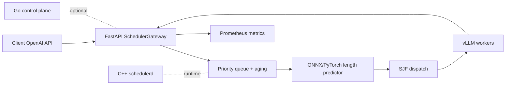

# AI Infrastructure Platform for Distributed Model Serving

### Predicted Shortest-Job-First scheduler gateway in front of vLLM with ONNX output-length prediction

[](https://github.com/ArchanaChetan07/AI-Infrastructure-Platform-for-Distributed-Model-Serving/actions/workflows/ci.yml)
[](https://www.python.org/)
[](tests/)
[](python/scheduler/gateway.py)
[](#license)

Multi-language ML serving platform: a **FastAPI gateway** schedules OpenAI-compatible requests with **predicted SJF + priority aging**, forwards to vLLM workers, and exposes Prometheus metrics. Includes ONNX/PyTorch output-length predictor, C++ scheduler runtime, Go control-plane stubs, Docker/K8s assets, and broad pytest coverage (GPU/vLLM tests skip without `HF_TOKEN`).

---

## Key Results

| Metric | Value | Source |
|---|---|---|
| Tracked files | **139** | git tree |
| Python modules | **51** | git tree |
| pytest functions | **96** | `tests/` |
| Scheduler policies | **FCFS, Oracle SJF, Predicted SJF** | `python/scheduler/sjf_scheduler.py` |
| Scheduler overhead target | **< 0.5 ms** (unit benchmarks) | `docs/PRODUCTION_CERTIFICATION_REPORT.md` §8 |
| Feature extraction target | **< 1 ms** on CPU | `docs/architecture.md` |
| Languages | Python, C++, Go, Dockerfile | repo layout |
| CI | GitHub Actions (Python, Go, C++, Docker) | `.github/workflows/` |

---

## Architecture



**How it works:** each `/v1/chat/completions` request is enqueued with a predicted output length; SJF orders the queue with anti-starvation aging, proxies to vLLM with timeouts and streaming support, and records queue depth / e2e latency histograms for observability.

---

## Tech Stack

| Layer | Choice |
|---|---|
| Gateway | FastAPI (`python/scheduler/gateway.py`) |
| Scheduling | Predicted SJF, FCFS, Oracle SJF, cancellation |
| Predictor | PyTorch training + ONNX export (`python/predictor/`) |
| Runtime | C++20 scheduler + Go API package |
| Serving target | vLLM (SmolLM3 port in `vllm_port/`) |
| Ops | Docker Compose, K8s manifests, Helm values |
| Tests | pytest (~85–90% cov on core packages per docs) |

---

## Features

- OpenAI-compatible proxy with `/health`, `/ready`, `/scheduler/stats`
- Graceful FCFS fallback when prediction fails
- Request timeout + client-disconnect cancellation
- Benchmark harness under `python/benchmark/` and `benchmarks/`
- Production certification docs with measured scheduler comparisons
- GPU validation path documented in `docs/GPU_SETUP.md` (requires `HF_TOKEN`)

---

## Installation & Usage

```bash
git clone https://github.com/ArchanaChetan07/AI-Infrastructure-Platform-for-Distributed-Model-Serving.git
cd AI-Infrastructure-Platform-for-Distributed-Model-Serving
pip install -r python/requirements.txt
pytest tests/ -q
```

```bash
# Start gateway (see configs/scheduler.yaml)
uvicorn scheduler.gateway:app --host 0.0.0.0 --port 8080

# Scheduler benchmarks
make benchmark-scheduler
```

---

## Project Structure

```text
AI-Infrastructure-Platform-for-Distributed-Model-Serving/
├── python/scheduler/       # gateway, SJF, priority queue, aging
├── python/predictor/       # training + ONNX inference
├── cpp/                    # scheduler runtime + tests
├── go/internal/api/        # control-plane API
├── vllm_port/              # SmolLM3 integration patches
├── docker/                 # scheduler, gateway, ml images
├── tests/                  # 96 pytest functions
└── docs/                   # architecture, certification, GPU setup
```

---

## License

See repository license file if present.
